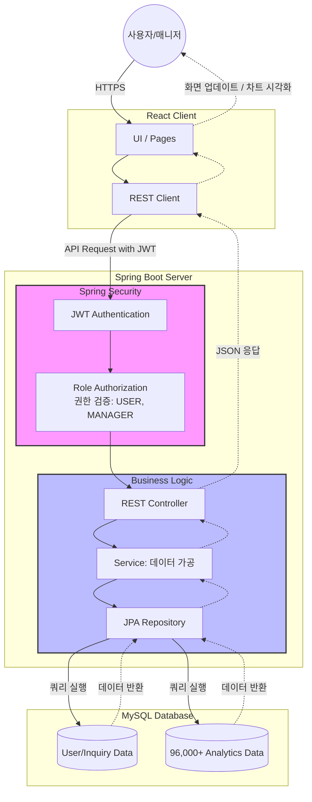
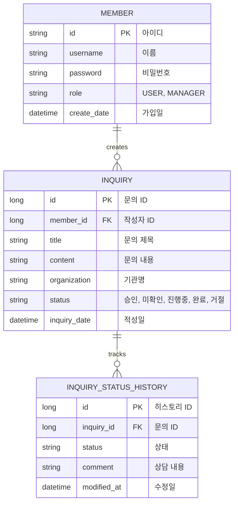

# 데이터 분석 의뢰 플랫폼

## 🛠 Tech Stack


<br>


### Backend
- **Language**: Java 17
- **Framework**: Spring Boot 3.5.0
- **Build Tool**: Maven
- **Security**: Spring Security, JWT, OAuth2 Client
- **Database**: MySQL
- **ORM**: Spring Data JPA
- **Library**: Lombok (코드 간소화)
- **Testing**: JUnit 5, AssertJ, Mockito (via Spring Boot Starter Test)

### Frontend
- **Library:** React
- **Visualization:** Recharts
- **State Management:** Axios (API Communication)

### Data
- [Brazilian E-Commerce Public Dataset by Olist](https://www.kaggle.com/datasets/olistbr/brazilian-ecommerce?select=olist_order_items_dataset.csv)
<br>

---

## 👥 Collaboration & Role
본 프로젝트는 프론트엔드 담당자와 협업하여 제작되었습니다.

- **My Role (Fullstack)**
    #### 1. Backend (Main)
    - **보안 및 인증**: Spring Security + JWT + OAuth2 기반의 통합 인증 아키텍처 설계 및 구현.
    - **비즈니스 로직**: 문의(Inquiry) 등록, 상태 관리, 히스토리 추적 로직 설계 및 구현.
    - **데이터 집계 API**: 대규모 주문 데이터를 가공하여 결제수단별 퍼널/전환율 산출 로직 구현.
    - **데이터베이스 설계**: 서비스 운영 및 분석 데이터 통합 스키마 설계.

    #### 2. Frontend
    - **인증 페이지**: 사용자 및 매니저 권한(Role)에 따른 UI 렌더링 분리 및 로그인 후 회원 정보 관리(수정/탈퇴) 기능 구현.
    - **문의 시스템**: 유저용 분석 의뢰 작성/조회 페이지 및 매니저용 의뢰 관리 UI 개발.

- **Teammate's Role (Frontend & Data Analysis)**
    - **데이터 전처리**: 대규모 CSV 데이터 분석 및 머신러닝 모델링 수행.
    - **시각화 대시보드**: Recharts를 활용한 분석 결과 시각화 및 프론트엔드 UI/UX 구현.
    - **데이터 분석 API 설계**: 분석 결과 데이터 제공을 위한 엔드포인트 구성 보조.
<br>

---
## 🏗 System Architecture

</br>

## 📌 Key Features

### 1. 보안 및 인증 (Auth & Security)
- **JWT 기반 인증 시스템:** Stateless한 토큰 기반 인증으로 보안성 강화.
- **역할 기반 인가(Role-based Authorization):** 사용자(USER)와 관리자(MANAGER) 권한을 분리하여 서비스 접근 권한을 엄격히 제어.
- **OAuth2 소셜 로그인:** 구글 등 소셜 계정 연동을 통한 사용자 접근성 향상.
- **프론트엔드 유효성 검사:** 정규표현식을 활용한 ID(4자 이상), PW(대소문자/숫자/특수문자 조합 8자 이상) 검증 로직 구현.

### 2. 데이터 분석 및 DB 최적화 (Data Analytics & Optimization)
- **MySQL View를 활용한 통계 최적화:** 9.6만 건의 데이터를 효율적으로 집계하기 위해 복잡한 JOIN 및 연산 로직을 DB View로 추상화하여 백엔드 응답 성능 향상.
- **비즈니스 KPI 산출 API:** 로우 데이터를 가공하여 시각화에 최적화된 전환율(Conversion Rate) 및 이탈률(Churn Rate) 지표 산출 로직 구현.
- **데이터 추적성(Audit Trail) 확보:** 상태 변경 히스토리 테이블을 별도로 설계하여 데이터 무결성을 보장하고 운영 시점의 모든 상태 변화를 기록.
- **대규모 데이터 스키마 설계 및 관리:** 약 96,000건의 분석용 대용량 CSV 데이터를 관계형 데이터베이스(MySQL)의 특성에 맞춰 테이블 구조화.
- **ML 예측 모델 결과 연계:** 머신러닝 모델을 통해 산출된 각 요소별 재구매 확률 예측 데이터를 데이터베이스로부터 조회하여 프론트엔드에 전달하는 API 구축.

### 3. 테스트 및 확장성 설계 (Testing & Scalability)
- **대규모 데이터 조회 인프라 구축:** 9.6만 건의 데이터 부하를 고려하여 JPA Pageable 기반의 페이징 및 정렬 시스템을 설계하고 테스트 코드로 성능 검증.
- **통합 테스트 및 검증:** JUnit 5를 활용하여 암호화 저장, 리포지토리 정합성 등 핵심 로직에 대한 안정성 확보.
- **시연용 데이터 시딩(Seeding):** 효율적인 개발 및 테스트 환경을 위해 다수의 더미 유저와 관리자 계정을 코드로 자동 생성하는 프로세스 구축.

### 4. 분석 의뢰 및 관리 시스템 (Inquiry Management)
- **사용자:** 분석 의뢰 등록, 진행 상황(승인/미확인/진행중/완료/거절) 실시간 조회, 회원 정보 수정 및 탈퇴 기능.
- **매니저:** 의뢰 목록 상태별 필터링, 실시간 상담 기록 업데이트 및 의뢰 상태 관리 기능.

### 5. 데이터 시각화 및 협업 (Visualization & Agility)
- Recharts 활용: 백엔드에서 집계된 JSON 데이터를 차트와 그래프로 시각화하여 사용자에게 인사이트 전달.
- AI 기반 고속 개발 및 협업: Claude/ChatGPT 등 AI 도구를 적극 활용하여 2주 내 풀스택 시스템을 구축하고, 공유 문서를 통한 작업 동기화로 협업 생산성 극대화.
<br>

---
## 📂 Project Structure (MVC 기반 레이어드 아키텍처)
```text
root/
├── backend/                    # Spring Boot 기반 REST API 서버
│   ├── src/main/java/edu/pnu   # 비즈니스 로직 및 API 컨트롤러
│   │   ├── config/             # Security 설정 클래스
│   │   ├── controller/         # REST API 엔드포인트 (Controller)
│   │   ├── service/            # 비즈니스 로직 및 데이터 가공 (Service)
│   │   ├── persistence/        # JPA Repository 인터페이스 (Persistence)
│   │   ├── domain/             # Entity 클래스 (Model)
│   │   └── util/               # 공통 유틸리티 기능
│   ├── src/test/java/edu/pnu   # 테스트
│   └── pom.xml                 # 프로젝트 의존성 관리
└── frontend/                   # React 기반 클라이언트 앱
    ├── src/                    # UI 컴포넌트 
    └── package.json            # 프론트엔드 라이브러리 관리
```
<br>

---
## 📊 Database ERD
<details>
<summary>전체 데이터 명세 보기</summary>
    
</details>


<br>

---

## 📑 API Reference

### 데이터 분석 API (Analytics)
| Method | Endpoint | Description | 
| :--- | :--- | :--- |
| GET | `/api/public/funnel/{payType}` | 결제수단별 주문 단계별 고객 이탈률 조회 |
| GET | `/api/delivery-analysis/datasets` | 사용 가능한 전체 데이터셋 목록 조회 |
| GET | `/api/delivery-analysis/dataset/{dataset}` | 특정 데이터셋의 전체 분석 데이터 반환 |
| GET | `/api/delivery-analysis/delivery-speed` | 배송 속도 구간별 실제 재구매율 조회 |
| GET | `/api/delivery-analysis/delivery-impact` | 배송 기간별 재구매 확률 변화 (ML 예측 데이터) |

### 유저 및 권한 API (User & Auth)
| Method | Endpoint | Description |
| :--- | :--- | :--- |
| POST | `/auth/signup` | 신규 회원가입 |
| POST | `/login` | 로그인 및 JWT 토큰 발급 |
| GET | `/api/member/info` | 로그인된 회원 정보 조회 |
| POST | `/api/member/update` | 회원 정보 수정 |
| POST | `/api/member/delete` | 회원 탈퇴 |
| POST | `/api/member/inquiry` | 신규 분석 의뢰(문의) 등록 |
| GET | `/api/member/inquiry` | 본인의 분석 의뢰 목록 조회 |
| GET | `/api/member/inquiry/{id}` | 특정 분석 의뢰 상세 내용 조회 |

### 관리자 API (Manager)
| Method | Endpoint | Description |
| :--- | :--- | :--- |
| GET | `/api/manager/inquiry` | 전체 유저의 분석 요청 목록 조회 |
| GET | `/api/manager/inquiry/{id}` | 특정 분석 요청 상세 보기 |
| POST | `/api/manager/inquiry/{id}/status` | 분석 상태 및 상담 내용 업데이트 |
